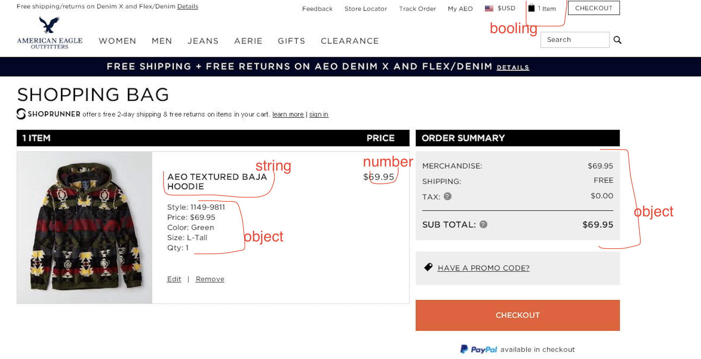

# Data Types Practice

## Instructions

Imagine you are building a shopping cart. Write some documentation on the data types that you would need to complete your shopping experience. How did you arrive at your choices?

String: a set of characters, that reside between single or double quotes.

Number: integer, negative, decimal, etc.

Booling: True/False.

Object: key-value pairs of collection of data.

Underfined: a variable without a value.

Null: denotes a null value.

## Rubric

| Criteria | Exemplary                                                                   | Adequate                    | Needs Improvement           |
| -------- | --------------------------------------------------------------------------- | --------------------------- | --------------------------- |
|          | The six data types are listed and explored in detail, documenting their use | Four datatypes are explored | Two data types are explored |
